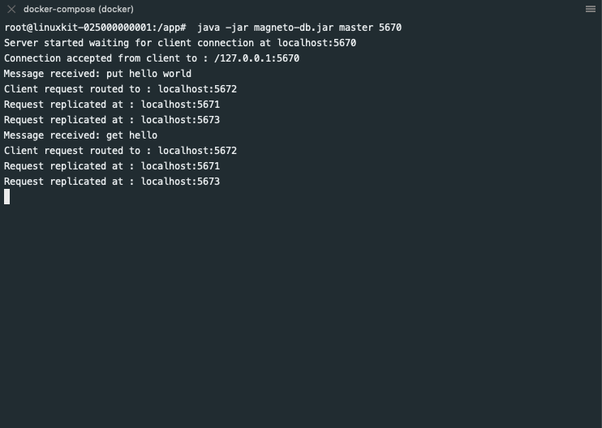

## Magneto DB

Test store designed based on [Consistent Hashing and
Bounded loads](https://arxiv.org/pdf/1608.01350.pdf) research paper. Consistent hashing was used to distribute
data across multiple nodes in the cluster. The communication channel was
implemented using JAVA NIO Socket Channel. A cluster was simulated using
docker for testing. The store client supports get and put operations. This
system also does partitioning, replication and failure handling. The store is
in-memory. 

### How to Run

Spin up docker containers of 5 nodes and 1 client

```
 docker-compose up --scale node=5 --build
```
Master Node
```
 java -jar magneto-db.jar master 5670
```

Other Nodes
```
 java -jar magneto-db.jar node 5671
 java -jar magneto-db.jar node 5672
 java -jar magneto-db.jar node 5673
 java -jar magneto-db.jar node 5674

```


Client connect to master node
```
 java -jar magneto-client.jar localhost 5670
```

### Screenshots

Master Shell


Partition Shell


Put Operation


Replication Shell

